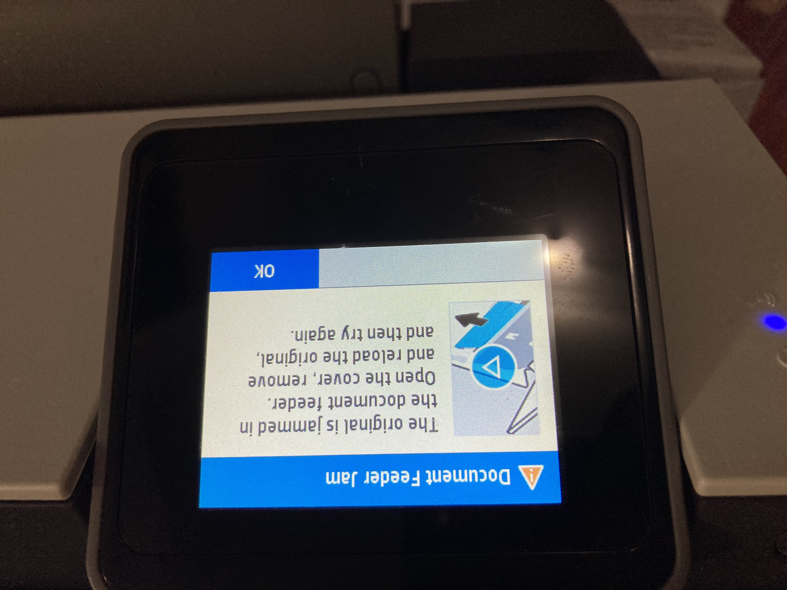
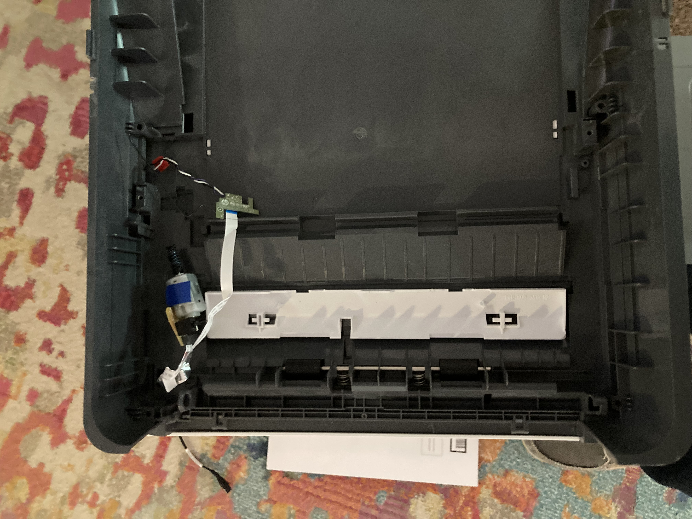

# HP-Officejet-Pro-9015-Document-Feeder-Jam
Hp printers shows "document feeder jam", how to remove the ADF (Auto Document Feeder). 

## do NOT cut the Ribbon Cables  
  

## Required Tools
T8, T9, T10 torx bit or drivers.  If you don't already have these, buy the whole kit of all the different bits from a big box store.    
Small and Large flat blade screw driver, used for leveraging plastic.  

## How to Access and Remove the ADF Motor Assembly on the HP OfficeJet Pro 9010
### Background
This [BCH](https://bchtechnologies.com/blogs/blog/how-to-fix-a-false-adf-document-feeder-jam-problem-hp-officejet-pro-8000-9000-series) video tutorial is a useful starting point, but the printer shown differs significantly from the 9010 model. This guide reflects what actually works on the 9010, including some shortcuts the video doesn't cover. 
I had intially started the dissambly process and wanted to keep the ADF but fix the issue. Getting to the fork sensor which i believe is the issue, appears to be very difficult. For me it became apparent that it was going to be easier to destroy the ADF and hopefully salvage the printer and flatbed scanner.  You might be able to cut the white wire of the fork sensor with less effort. Give that a shot if you can get to it. In my understanding the white wire is the output from that sensor. 
### Step 0: Unplug the printer. If you don't keep the printer flat, it may leak ink.  
### Step 1: Disassemble the Top/ADF Housing
Begin by removing the top panel to gain access to the Auto Document Feeder (ADF). Fair warning: this process is destructive on the 9010. Expect to break plastic — that's normal and okay, as long as you're not planning to reassemble the ADF afterward.  
**The critical rule throughout disassembly: protect the ribbon cables and the components they connect to.**  
### Step 2: Cut the IR Fork/Slot Sensor Wires
You'll notice a pair of intertwined black and white wires running to a small horseshoe-shaped component — this is the IR Fork/Slot Sensor. If you're okay with fully removing the ADF, you can simply cut these wires. No need to carefully disconnect them.
### Step 3: Remove the Motor Assembly
With the housing open, locate the motor assembly inside its plastic cage. It's held in place by a single screw — remove it and the motor comes right out.
### Step 4: Identify the Two Components You Need
You're after just two parts:

The motor which includes a sensor. [motor_and_jam_sensor2](motor_and_jam_sensor2.jpg)  
The circuit board connected to the fork sensor, [circuit that goes to jam sensor1 ](circuit_goes_to_jam-sensor1.jpg)  

### Step 5: Connect the Components via Ribbon Cables
Each part connects to a dedicated ribbon cable:

The motor connects to the short ribbon cable
The fork sensor circuit board connects to the long ribbon cable

Make sure both connections are secure before moving on.  
Final Picture, needs a little work.  
  
